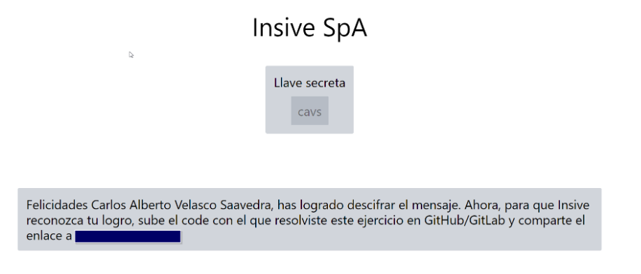

## 🚀 Estructura del proyecto

Dentro de su proyecto Astro, verá las siguientes carpetas y archivos:

```text
/
├── public/
│   └── favicon.svg
├── src/
│   ├── components/
│   │   └── Card.astro
|   |   └── MessageKeyUser.astro
|   |   └── MessageKeyUser.astro
│   ├── layouts/
│   │   └── Layout.astro
│   └── pages/
│       └── index.astro
└── package.json
```

Astro busca archivos `.astro` o `.md` en el directorio `src/pages/`. Cada página se expone como una ruta según su nombre de archivo.

No hay nada especial en `src/components/`, pero ahí es donde nos gusta colocar los componentes Astro/React/Vue/Svelte/Preact.

Cualquier activo estático, como imágenes, se puede colocar en el directorio `public/`.

## 🧞 Correr el proyecto

| Command                   | Action                                           |
| :------------------------ | :----------------------------------------------- |
| `npm install`             | Installs dependencies                            |
| `npm run dev`             | Starts local dev server at `localhost:4321`      |
                     
## Codigo backend
```
 https://github.com/alberto8812/Insive-Mensaje-Oculto.git
```
## Display de Usurio 


